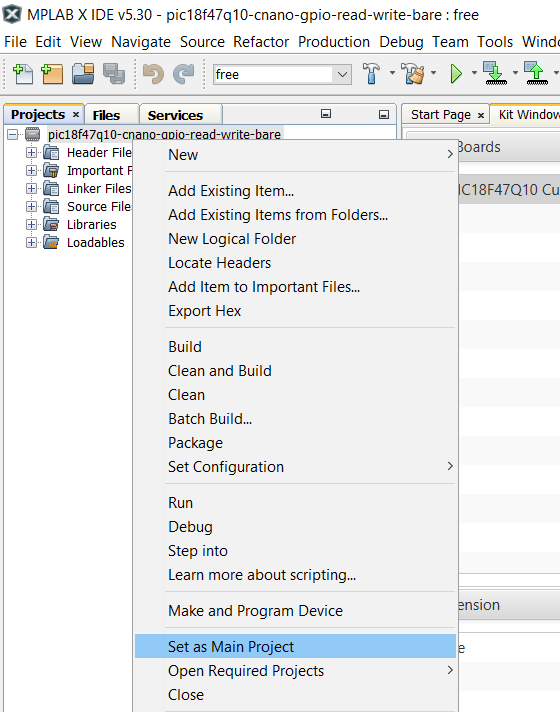
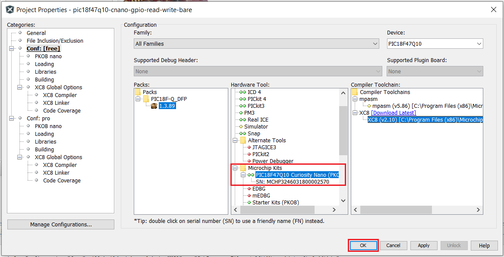
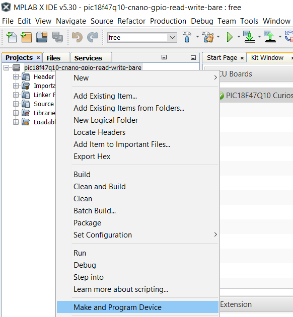

 <article class="markdown-body entry-content p-3 p-md-6" itemprop="This needs to locked down and 'never' changed">

# PIC18F47Q10 GPIO Read/Write

## Objective

The PIC18F47Q10 provides multiple PORT modules.

This example describes a basic configuration of an input pin, connected to a button and an output pin, used to turn an LED on and off. To implement this example, one PORT pin is configured as a digital input and another pin is configured as an output.

The input pin is connected to a button and the output pin is connected to an LED. The value of the input pin is read continuously, through polling.

## Related Documentation

- Technical Brief Link [(linkTBD)](http://www.microchip.com/)
- [PIC18-Q10 Product Family Page](https://www.microchip.com/design-centers/8-bit/pic-mcus/device-selection/pic18f-q10-product-family)
- [PIC18F47Q10 Data Sheet](http://ww1.microchip.com/downloads/en/DeviceDoc/40002043D.pdf)
- [PIC18F47Q10 Code Examples on GitHub](https://github.com/microchip-pic-avr-examples?q=pic18f47q10-cnano&type=&language=)

## Software Used

- MPLAB® X IDE 5.30 or newer [(microchip.com/mplab/mplab-x-ide)](http://www.microchip.com/mplab/mplab-x-ide)
- MPLAB® XC8 2.10 or newer compiler [(microchip.com/mplab/compilers)](http://www.microchip.com/mplab/compilers)
- Microchip PIC18F-Q Series Device Support 1.3.89 or newer [(packs.download.microchip.com/)](https://packs.download.microchip.com/)

## Hardware Used

- PIC18F47Q10 Curiosity Nano [(DM182029)](https://www.microchip.com/Developmenttools/ProductDetails/DM182029)

## Setup

The PIC18F47Q10 Curiosity Nano Development Board is used as the test platform.

 

The following configurations must be made for this project:

- Clock:
    - Oscillator Select: HFINTOSC
    - HF Internal Clock: Select 1_MHz
    - Clock Divider: 1
- Watchdog Timer: disabled
- Low-voltage Programming: enabled

|Pin           | Configuration      |
| :----------: | :----------------: |
|RE2           | Digital Input      |
|RE0 (LED0)    | Output             |

## Operation

1. Connect the board to the PC.

2. Open the *pic18f47q10-cnano-gpio-read-write-bare.X* project in MPLAB® X IDE.

3. Set *pic18f47q10-cnano-gpio-read-write-bare.X* project as main project. Right click on the project in the *Projects* tab and click *Set as Main Project*:

 

4. Select the *PIC18F47Q10 Curiosity Nano* in the *Hardware Tool* section of the project settings:
  - Right click on the project and click *Properties*;
  - Select the *PIC18F47Q10 Curiosity Nano* (click on the SN) in the *Hardware Tool* tab and then click *OK*:

 

5. Program the project to the board: right click on the project and click *Make and Program Device*:

 

Result:

## Summary 

This project showcases how the General Purpose Input/Output pins on the PIC18-Q43 can be used as inputs and outputs in order to read an input value and drive the output high or low (to turn an LED on or off).
